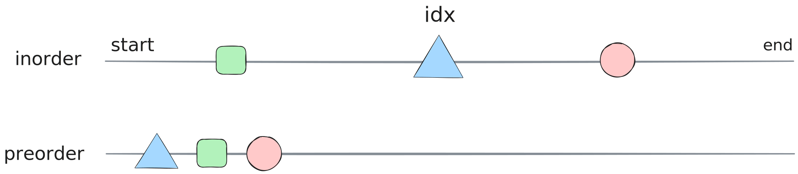

# 105. Construct Binary Tree from Preorder and Inorder Traversal



#### Recursive Approach

- use hashmap, track value index relationship
- use queue (preorder) to get the next *root*

```python
{{#include code/105.py}}
```

| time complexity | space complexity |
| --------------- | ---------------- |
| \\( O(n) \\)    | \\( O(n) \\)     |
