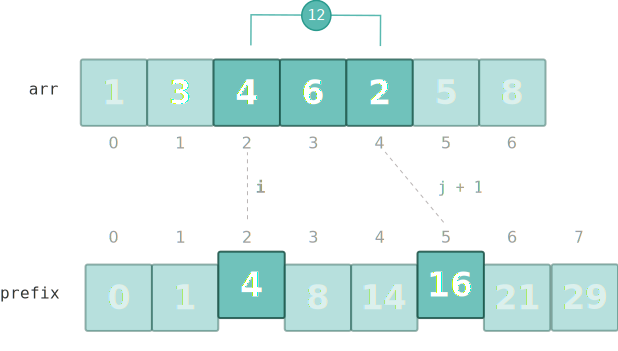

# Prefix Sum
A prefix sum, or cumulative sum, is a new array where each element is the sum of all elements up to that position in the original array



```python
n = len(A)
prefix = [0] * (n + 1)
for i in range(1, n + 1):
    prefix[i] = prefix[i - 1] + arr[i - 1]
```

#### Related Problems
- [560. Subarray Sum Equals K](../leetcode/560.md)
